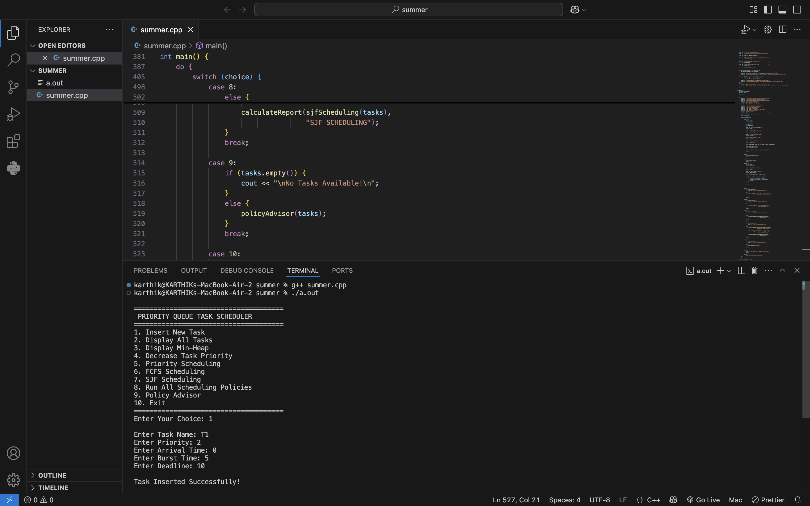
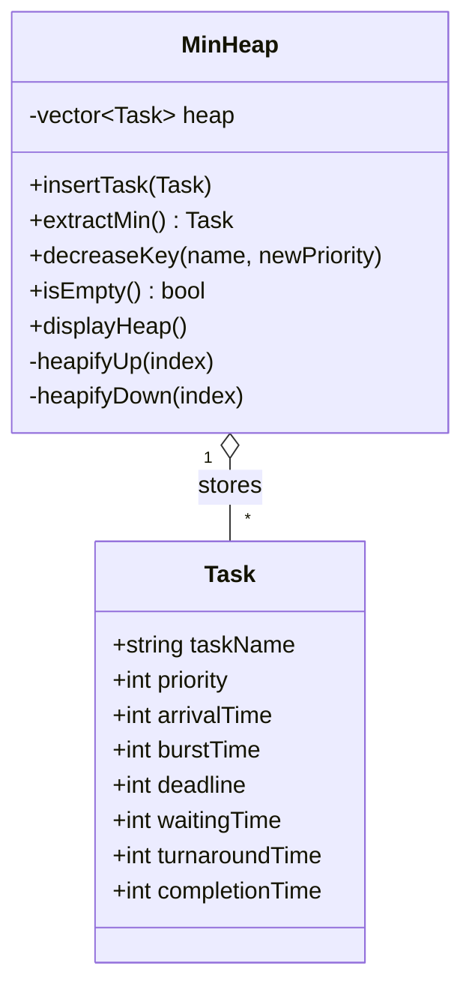
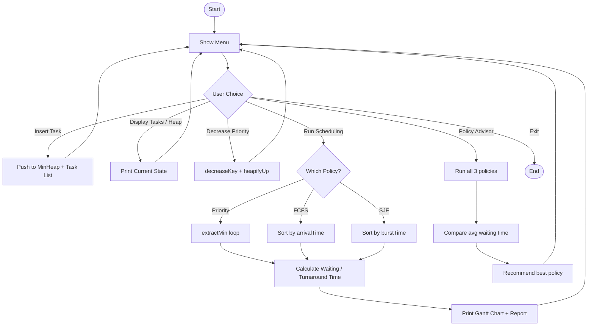
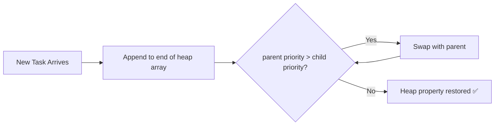

<div align="center">

# ⏱️ Priority Queue Task Scheduler

**A CPU task-scheduling simulator built in C++, powered by a hand-written Min-Heap.**

Compare Priority Scheduling, FCFS, and SJF side-by-side — complete with Gantt charts, waiting/turnaround time analytics, and an automatic policy advisor that tells you which algorithm performed best.


[Overview](#-overview) • [Features](#-features) • [Architecture](#-architecture) • [Quick Start](#-quick-start) • [How It Works](#-how-it-works) • [Sample Run](#-sample-run) • [Roadmap](#-roadmap) • [Team](#-team)

</div>

---

## 📸 Preview



---

## 📖 Overview

| | |
|---|---|
| **Project Title** | Priority Queue Task Scheduler |
| **Department** | Computer Science and Engineering |
| **Subject** | Data Structures |
| **Academic Year** | 2025–26 |
| **Language** | C++ (OOP, STL) |
| **Interface** | Console / CLI |

A scheduling task can be tackled by more than one algorithm — but which one is actually *best* for a given workload? This project builds all three classic approaches on top of a single Min-Heap engine, runs them against the same task set, and reports which policy minimizes average waiting time.

---

## ✨ Features

- 🔺 **Custom Min-Heap** — priority queue built from scratch (no `std::priority_queue`), with `heapifyUp`/`heapifyDown` and `decreaseKey`
- 📊 **Three Scheduling Policies** — Priority, FCFS, and SJF
- 📈 **ASCII Gantt Chart** — visual execution timeline for every run
- ⏳ **Automatic Metrics** — average waiting time & turnaround time per policy
- 🧭 **Policy Advisor** — runs all three policies and recommends the optimal one, with a reason
- 🖥️ **Menu-Driven CLI** — insert, inspect, and reprioritize tasks live

---

## 🏗️ Architecture

### Class Design



### Program Flow



### Min-Heap Insertion (heapifyUp)



---

## 🚀 Quick Start

```bash
# Clone the repo
git clone https://github.com/modepallivivek/Priority-Queue-Task-Scheduler.git
cd Priority-Queue-Task-Scheduler

# Compile
g++ Priority_queue.cpp -o scheduler

# Run
./scheduler
```

No external dependencies — just a standard C++ compiler (GCC / Clang / MSVC).

> 📄 Full source: [`Priority_queue.cpp`](./Priority_queue.cpp)

<details>
<summary>🧩 Peek at the core Min-Heap logic</summary>

```cpp
void heapifyUp(int index) {
    while (index > 0 &&
           heap[index].priority < heap[parent(index)].priority) {
        swap(heap[index], heap[parent(index)]);
        index = parent(index);
    }
}
```

</details>

---

## ⚙️ How It Works

1. **Insert** tasks with a name, priority, arrival time, burst time, and deadline
2. Tasks are pushed into the **Min-Heap**, which always keeps the highest-priority task at the root
3. Pick a scheduling policy — the scheduler extracts tasks in the right order and simulates execution
4. Waiting time and turnaround time are computed per task, then averaged
5. Run **Policy Advisor** to compare all three algorithms on the exact same workload and get a verdict

---

## 🧪 Sample Run

**Input**

| Task | Priority | Arrival | Burst | Deadline |
|------|:---:|:---:|:---:|:---:|
| T1 | 2 | 0 | 5 | 10 |
| T2 | 1 | 1 | 3 | 8 |
| T3 | 3 | 2 | 4 | 12 |
| T4 | 4 | 3 | 2 | 7 |

**Output**

```
======================================
 PRIORITY QUEUE TASK SCHEDULER
======================================

Execution Order:
T2 -> T1 -> T3 -> T4

ASCII Gantt Chart:
| T2 | T1 | T3 | T4 |
0     3     8     12    14

Average Waiting Time    : 4.25
Average Turnaround Time : 7.75
```

---

## 📂 Repository Structure

```
Priority-Queue-Task-Scheduler/
├── Priority_queue.cpp       # Full source code
├── README.md
├── Flow chart                # Design flow chart
├── UML Diagram                # UML class diagram
├── Sample Output               # Example run output
└── Output_Screenshot.png        # Program screenshot
```

---

## 🗺️ Roadmap

- [x] Priority / FCFS / SJF scheduling
- [x] ASCII Gantt chart
- [x] Policy Advisor
- [ ] Round Robin scheduling
- [ ] Preemptive priority scheduling
- [ ] File-based task persistence
- [ ] GUI front-end
- [ ] Export report as PDF

---

## 🧠 Concepts Demonstrated

`Classes & Objects` · `Encapsulation` · `Vectors` · `Min-Heap` · `Priority Queue` · `Heapify Up/Down` · `Sorting` · `CPU Scheduling` · `Functions` · `Control Flow`

---

## 🤝 Contributing

Contributions are welcome! To propose a change:

1. Fork the repository
2. Create a feature branch (`git checkout -b feature/amazing-feature`)
3. Commit your changes (`git commit -m 'Add amazing feature'`)
4. Push to the branch (`git push origin feature/amazing-feature`)
5. Open a Pull Request

---

## 👥 Team

- Vannala Ramcharan
- Modepalli Vivek
- Shushanth Sadanapally
- Bandari Usha Sree
- Tekulapally Manikanta

---

## 📄 License

Distributed under the MIT License.

---

## 📌 Conclusion

The Priority Queue Task Scheduler demonstrates how CPU scheduling algorithms behave on identical workloads by grounding them all in one Min-Heap implementation — turning an abstract Data Structures & OS concept into something you can run, tweak, and measure.

<div align="center">

[⬆ Back to top](#️-priority-queue-task-scheduler)

</div>
